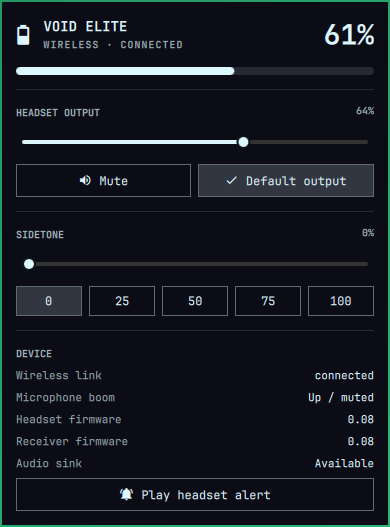

# Corsair VOID Elite for Omarchy



An Omarchy bar widget for the Corsair VOID Elite Wireless headset.

## Requirements

- Omarchy 4 with the Quickshell-based shell
- Linux 6.13 or newer with the in-kernel `hid-corsair-void` driver
- UPower and PipeWire, included with Omarchy

## Install

```bash
omarchy plugin add https://github.com/AlexR1712/omarchy-corsair-void.git --enable
```

The plugin appears in the default bar section chosen by Omarchy. You can move it explicitly with:

```bash
omarchy bar move corsair-void --section right
```

## Features

- Battery percentage and charge state through Quickshell's native UPower service
- Exact wireless connected/disconnected state from the in-kernel `hid-corsair-void` driver
- Persistent low-battery desktop notifications at 20% and 10%, emitted once across all monitors
- Native PipeWire output volume, mute, and default-output selection
- Hardware sidetone presets and slider
- Microphone boom position, headset/receiver firmware, and built-in alert test
- Configurable refresh interval and compact/percentage bar display

Left-click opens the panel, right-click toggles headset output mute, middle-click refreshes immediately, and the mouse wheel changes volume. The panel supports arrow-key navigation plus `M` for mute, `D` for default output, `R` for refresh, and `A` for the headset alert.

## Hardware permissions

Battery monitoring and audio controls work without extra privileges. The kernel exposes sidetone and the built-in alert as root-only sysfs controls. The bundled rule grants the Omarchy `wheel` group write access only to this headset driver's `set_sidetone` and `send_alert` attributes. The plugin itself contains no privilege-elevation path.

Install the root-owned rule once, then reconnect the wireless dongle:

```bash
sudo install -Dm0644 \
  ~/.config/omarchy/plugins/corsair-void/udev/99-corsair-void-omarchy.rules \
  /etc/udev/rules.d/99-corsair-void-omarchy.rules
sudo udevadm control --reload-rules
```

The panel will report hardware controls as available after the receiver is reconnected.

To remove the extra permission later:

```bash
sudo rm /etc/udev/rules.d/99-corsair-void-omarchy.rules
sudo udevadm control --reload-rules
```

## Controls

- Left click: open the panel
- Right click: mute or unmute the headset output
- Middle click: refresh hardware information
- Mouse wheel: change headset volume
- Keyboard: arrows navigate and adjust; `M` mutes, `D` selects the default output, `R` refreshes, and `A` plays the headset alert

For a machine-readable health check:

```bash
omarchy-shell corsair-void state
```

## License

MIT
